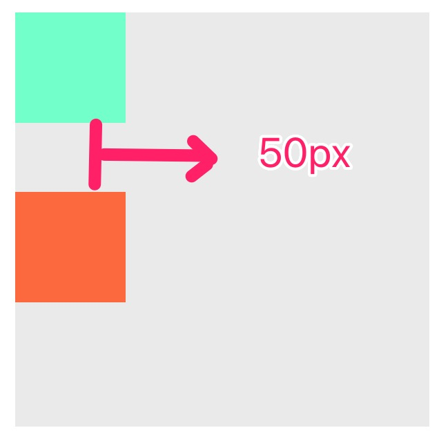
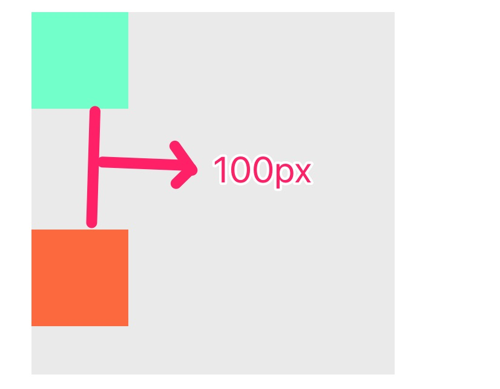
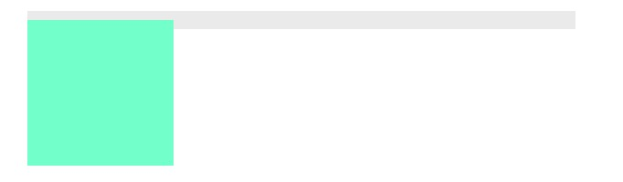
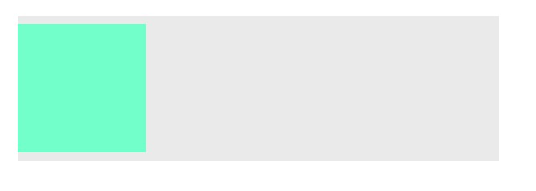
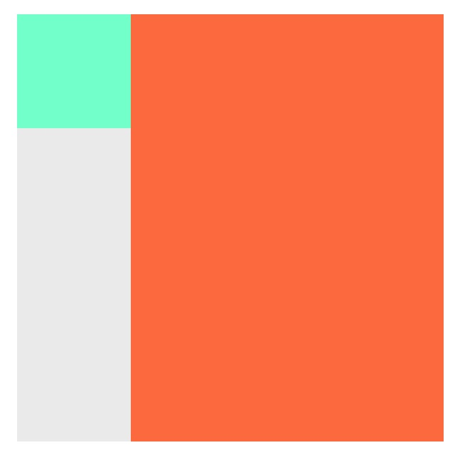

## BFC and IFC
### Box
一个页面是由很多个Box组成的，元素的类型和display属性决定了这个Box的类型。不同类型的 Box，会参与不同的 Formatting Context。
- **Block-level-box** : 会参与形成BFC，比如display为block，list-item，table的元素
- **Inline-level-box** : 会参与形成IFC，比如display为inline，inline-table，inline-block的元素

### BFC —— 块级作用域上下文(Block Formatting Context)
BFC是页面中的**独立渲染区域**，对于外部元素来说，它是一个**黑盒**。BFC只有Block-level-box参与，它规定了内部Block-level-box的定位和布局，并且与这个区域外部毫不相干。

#### BFC中规定Block-level-box的定位规则
1. 内部的Block-level-box会在**垂直方向**上一个接一个放置，水平方向会充满
2. Block-level-box在垂直方向上的距离由margin来决定，属于**同一个BFC中相邻的**两个Block-level-box的margin会发生**重叠**
3. 每个元素的左外边缘（**margin-left**)， 与包含块的左边（**contain box left**）相接触(对于从左往右的格式化，否则相反)。浮动元素也是如此，但是绝对定位可能会超出包含块的边界
4. **BFC区域不会和float box发生重叠**(***自适应多栏布局***)
5. BFC就是页面上的一个**隔离的独立容器**，容器里面的子元素不会影响到外面的元素。反之也如此（***防止margin重叠***）
6. 计算BFC的高度时，**浮动子元素**也需要参与计算（**清除浮动**）

#### 常用的形成BFC的方式
1. 根元素或者其他包含的元素
2. float不为none的元素
3. 绝对定位的元素（position为absolute或fixed）
4. display为：inline-block,table-cell,table-caption
5. overflow不为visiable
6. display:flex
7. display:grid

所有的方式参考这里：[传送门](https://developer.mozilla.org/zh-CN/docs/Web/Guide/CSS/Block_formatting_context)

#### BFC的应用场景
##### 1.防止margin重叠
###### margin重叠
```js
// html
<div class="container">
  <div class="top"></div>
  <div class="bottom"></div>
</div>

// css
.container{
  width: 300px;
  height: 300px;
  margin: 100px;
  background-color: #eeeeee;
}
.top{
  background-color: aquamarine;
  width: 80px;
  height: 80px;
  margin-bottom: 50px;
}
.bottom{
  background-color: coral;
  width: 80px;
  height: 80px;
  margin-top: 50px;
}
```  


###### 解决margin重叠
```js
// html
<div class="container">
  <div class="top"></div>
  <div class="bfc">
    <div class="bottom"></div>
  </div>
</div>

// css
.container{
  width: 300px;
  height: 300px;
  margin: 100px;
  background-color: #eeeeee;
}
.top{
  background-color: aquamarine;
  width: 80px;
  height: 80px;
  margin-bottom: 50px;
}
.bfc{
  overflow: hidden;
}
.bottom{
  background-color: coral;
  width: 80px;
  height: 80px;
  margin-top: 50px;
}
```  


##### 2.清除浮动
###### 产生浮动的现象
```js
// html
<div class="container">
  <div class="top"></div>
</div>

// css
.container{
  width: 300px;
  margin: 100px;
  padding: 5px 0px;
  background-color: #eeeeee;
}
.top{
  float: left;
  background-color: aquamarine;
  width: 80px;
  height: 80px;
}
```  


###### 利用BFC清除浮动
```js
<div class="container">
  <div class="top"></div>
</div>

// css
.container{
  width: 300px;
  margin: 100px;
  padding: 5px 0px;
  background-color: #eeeeee;
  overflow: hidden; //生成一个新的BFC
}
.top{
  float: left;
  background-color: aquamarine;
  width: 80px;
  height: 80px;
}
```  


##### 3.自适应两栏布局
```js
// html
<div class="container">
  <div class="left"></div>
  <div class="right"></div>
</div>

// css
.container{
  width: 300px;
  height: 300px;
  margin: 100px;
  background-color: #eeeeee;
}
.left{
  float: left;
  background-color: aquamarine;
  width: 80px;
  height: 80px;
}
.right{
  height: 100%;
  background-color: coral;
  overflow: hidden; //bfc
}
```  


### IFC —— 行内格式化上下文（Inline Formatting Context）
IFC只有inline-level-box参与，它规定了内部inline-level-box的定位和布局，并且与这个区域外部毫不相干。

#### IFC的布局规则
1. 内部的inline-level-box一个一个水平排列，起点是包含块的顶部。
2. **水平方向**上的 margin，border 和 padding在框之间得到保留。垂直方向上display为inline-block的box会保留margin，border 和 padding。
3. 框在垂直方向上可以以不同的方式对齐：它们的顶部或底部对齐，或根据其中**文字的基线对齐**

### 参考资料
1. [10 分钟理解 BFC 原理](https://zhuanlan.zhihu.com/p/25321647)
2. [BFC与IFC概念理解+布局规则+形成方法+用处](https://segmentfault.com/a/1190000009545742)


