## 边框与背景

### 1.多重边框
#### box-shadow方案
理论上可以实现无限多层边框
```js
// html
<div class="box">box-shadow unset</div>
<div class="box1">box-shadow inset</div>

// css
.box{
  width: 120px;
  height: 120px;
  background-color: antiquewhite;
  box-shadow: 0 0 0 10px red,
              0 0 0 15px blue;
  margin: 15px;
  display: inline-block;
}
.box1{
  width: 120px;
  height: 120px;
  background-color: antiquewhite;
  box-shadow: 0 0 0 5px blue inset,
              0 0 0 15px red inset;
  padding: 15px;
  display: inline-block;
}
```


缺点：
1. box-shadow**本身不占位置**，需要通过设置内边距或者外边距来模拟它的”占位“.
2. unset的投影在元素的外圈，并**不是元素的可点击范围**，无法触发点击事件。可以使用inset的形式来绕过这一个问题。
3. 边框的样式只能是**实线**的。

#### outline方案
可以实现两层边框，而且边框样式可以多样。
```js
// html
<div class="box2">outline dotted</div>
<div class="box3">outline radius</div>
<div class="box4">outline inner</div>

// css
.box2{
  width: 120px;
  height: 120px;
  background-color: antiquewhite;
  border: 10px solid red;
  outline: 5px dotted blue;
  display: inline-block;
}
.box3{
  width: 120px;
  height: 120px;
  background-color: antiquewhite;
  border-radius: 10px;
  border: 10px solid red;
  outline: 5px solid blue;
  display: inline-block;
  margin: 0 20px;
}
.box4{
  width: 120px;
  height: 120px;
  background-color: antiquewhite;
  border: 20px solid red;
  outline: 2px dotted blue;
  outline-offset: -10px;
  display: inline-block;
  margin: 0 20px;
}
```  


缺点：
1. 只能模拟两层边框的场景。
2. 边框外边的outline也是不占位置的，有被覆盖的风险。
3. 圆角的outline不贴合，outline仍然是矩形的。

### 2.背景图片定位
需要实现背景图片的灵活定位
#### background-position方案
非常灵活的方案，可以定位任意的地方
```js
// html
<div class="box">background-position</div>

// css
.box{
  width: 200px;
  height: 120px;
  background-color: lightcyan;
  background-image: url('./apple.png');
  background-repeat: no-repeat;
  background-position: right 20px bottom 20px;
}
```  
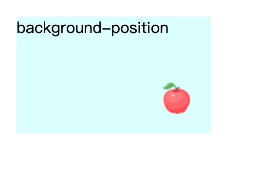

#### background-origin方案
针对三种box-sazing来定位背景图片

```js
// html
<div class="box1">background-position</div>
<div class="box2">background-origin</div>

// css
.box1{
  display: inline-block;
  width: 200px;
  height: 120px;
  background-color: lightcyan;
  background-image: url('./apple.png');
  background-repeat: no-repeat;
  padding: 20px;
  background-position: right 20px bottom 20px;
}
.box2{
  display: inline-block;
  width: 200px;
  height: 120px;
  background-color: lightcyan;
  background-image: url('./apple.png');
  background-repeat: no-repeat;
  background-position: right bottom;
  padding: 20px;
  background-origin: content-box;
}
```  
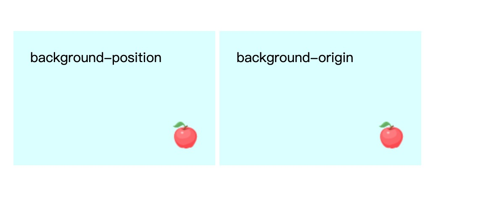

可以看出，在这种场景中，使用backgroud-origin更加贴合，如果以后padding发生改变，这个方法修改的地方更少。

#### calc()方案
计算的方式
```js
// html
<div class="box3">background-position</div>

// css
.box3{
  width: 200px;
  height: 120px;
  background-color: lightcyan;
  background-image: url('./apple.png');
  background-repeat: no-repeat;
  background-position: calc(100% - 20px) calc(100% - 10px);
}
```  
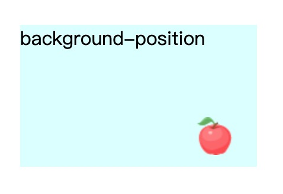

### 3.边框内圆角
#### 多个元素组合
这种方式非常灵活，可以借助背景来实现多样的边框效果
```js
// html
<div class="box">
  <div class="inner">两个元素实现</div>
</div>

// css
.box{
  height: 150px;
  width: 200px;
  background-color: antiquewhite;
  padding: 20px;
}
.inner{
  height: 110px;
  padding: 20px;
  border-radius: 20px;
  background-color: aquamarine;
}
```  
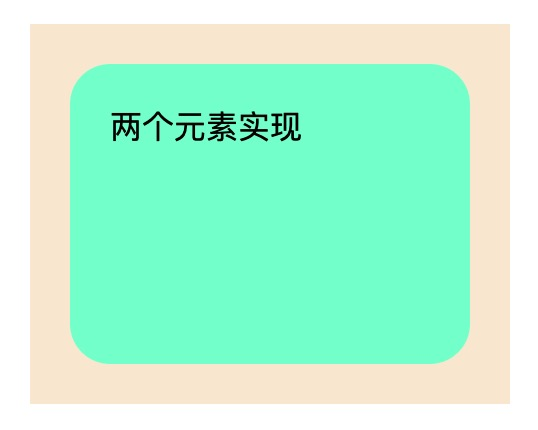

#### 借助box-shadow和outline来实现
利用box-shadow和outline对于圆角边框的不同实现，来实现一个元素实现内部圆角的效果
```js
// html
<div class="box1">box-shadow & outline</div>

// css
.box1{
  width: 200px;
  height: 110px;
  padding: 20px;
  border-radius: 20px;
  background-color: aquamarine;
  outline: 20px solid antiquewhite; //不贴合圆角
  box-shadow: 0 0 0 10px antiquewhite; // 贴合圆角
}
```  
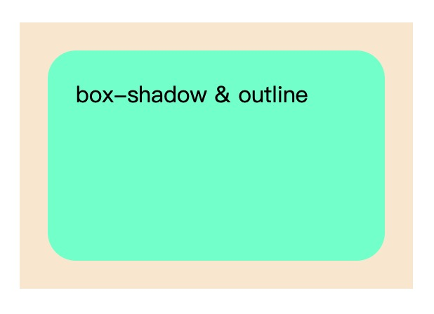

注意点：
1. 圆角半径r、outline宽度m和box-shadow的宽度n必须要满足这个关系：**(Math.sqrt(2)-1)*r < n < m**
2. 这里利用的是outline不贴合圆角的效果来实现的，可以归属为一种hack，未来如果浏览器修正了无法使用这种方式了。

### 4.条纹背景
使用linear-gradient()和background-size来实现条纹背景

##### linear-gradient()渐变角度
- 角度是渐变线与渐变容器中心点向上垂直线之间的夹角
- 0deg的意思就是to top，默认是to bottom,也就是180deg
- 顶角关键词的**渐变线角度**和渐变容器尺寸有关，比如top right方向时，渐变线需要和左上角到右下角的对角线**垂直**，所以角度和容器的尺寸是息息相关的

##### linear-gradient()一些规则
1. 如果多个色标具有相同的位置，它们会产生一个无限小的过渡区域， 过渡的起止色分别是第一个和最后一个指定值。从效果上看，颜色会在那个位置**突然变化**，而不是一个平滑的渐变过程
2. 如果某个色标的位置值比整个列表中在它之前的色标的位置值都要小，则该色标的位置值会被设置为它前面所有色标位置值的**最大值**

##### linear-gradient的参考文章
[你真的理解CSS的linear-gradient？](https://www.w3cplus.com/css3/do-you-really-understand-css-linear-gradients.html)

##### 水平条纹背景
```js
// html
<div class="box">水平条纹背景</div>

// css
.box{
  width: 200px;
  height: 160px;
  background: linear-gradient(180deg,red 25%,orange 25%,orange 50%,blue 50%,blue 75%,green 75%);
  background-size: auto 50%;
}
```  
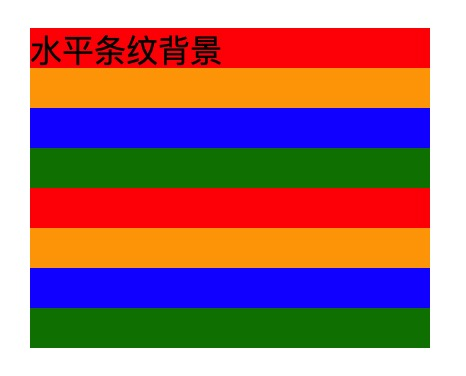

##### 垂直条纹背景
```js
// html
<div class="box1">垂直条纹背景</div>

// css
.box1{
  width: 200px;
  height: 160px;
  background: linear-gradient(90deg,red 25%,orange 25%,orange 50%,blue 50%,blue 75%,green 75%);
  background-size: 40% auto;
}
```  
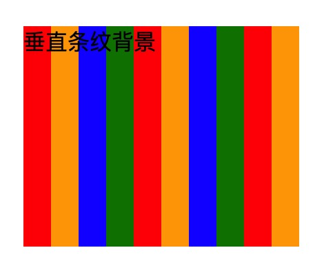

##### 斜向条纹

###### 1.使用linear-gradient和background生成
使用background-size是为了使用它的无限重复效果
```js
// html
<div class="box2">斜向条纹背景</div>

// css
.box2 {
  width: 200px;
  height: 160px;
  background: linear-gradient(
    45deg,
    red 0 25%,
    orange 25% 50%,
    red 50% 75%,
    orange 75%
  );
  background-size: 40px 40px; //利用这个属性来限定条纹的宽度，而且无限重复
}
```  
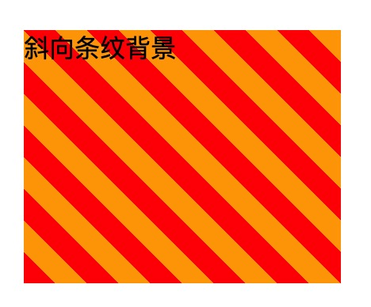

这种方式是通过设置一个小的区域，然后**无缝拼接**形成的。但是这个方式的只适合45deg的场景，如果是其他的角度的话，并不能实现这种无缝拼接。

###### 2.使用repeating-linear-gradient
```js
// html
<div class="box3">斜向条纹背景repeating 45deg</div>
<div class="box4">斜向条纹背景repeating 60deg</div>

// css
.box3 {
  width: 200px;
  height: 160px;
  color: #fff;
  background: repeating-linear-gradient(
    45deg,
    blue 0 20px,
    orange 20px 40px,
    green 40px 60px
  );
  display: inline-block;
}

.box4 {
  width: 200px;
  height: 160px;
  color: #fff;
  background: repeating-linear-gradient(
    60deg,
    blue 0 20px,
    orange 20px 40px,
    green 40px 60px
  );
  display: inline-block;
}
```  
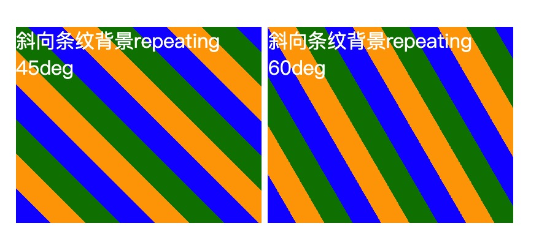

### 5.图像边框
希望可以实现图像边框，并且随着盒子尺寸的变化，边框各处的背景也随之变化，边框背景图片可以自动延伸并且覆盖整个边框位置。

#### 利用两个元素实现
```js
// html
<div class="box">
  <div class="inner">利用两个元素实现</div>
</div>

// css
.box{
  height: 100px;
  width: 300px;
  padding: 30px;
  background-image: url('./timg.jpeg');
  background-size: cover;
}
.inner{
  background-color: #ffffff;
  height: 100%;
}
``` 
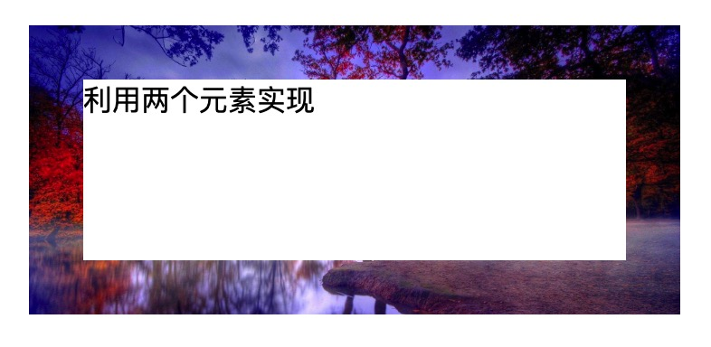
利用这种方式伪造边框，但是需要借助两个元素才可以实现。

#### 一个元素实现(border-image)
[border-image用法参考](https://aotu.io/notes/2016/11/02/border-image/index.html)

```js
// html
<div class="box1">border-image</div>

// css
.box1{
  height: 100px;
  width: 300px;
  border: 30px solid #ffffff;
  border-image-source: url('./timg.jpeg');
  border-image-slice: 30 30 30 30;
}
```  
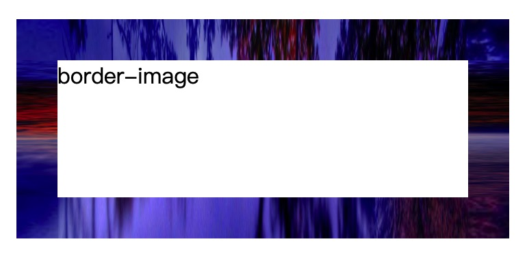

使用这种方式实现的图像边框会导致，四个角所占据的图像区域不变，无法做到随尺寸变化而变动。

#### 使用background渐变实现
```js
// html
<div class="box2">background</div>

// css
.box2{
  height: 100px;
  width: 300px;
  border: 30px solid transparent;
  background: linear-gradient(#fff,#fff),url('./timg.jpeg');
  background-clip: padding-box,border-box;
  background-origin: border-box;
  background-size: cover;
}
```  
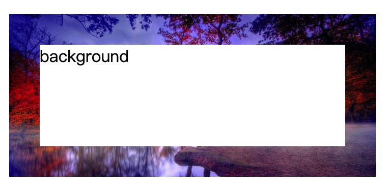

这种方式可以达到预期的结果。边框图片在随着尺寸的变化而变化。

#### 使用信封边框的效果
```js
// html
<div class="box3">信封边框</div>

// css
.box3 {
  height: 100px;
  width: 300px;
  border: 30px solid transparent;
  background: linear-gradient(#fff 0 100%) padding-box,
    repeating-linear-gradient(
        135deg,
        red 0 10px,
        #fff 10px 20px,
        #58a 20px 30px,
        #fff 30px 40px
      )
      border-box;
}
```  

#### 实现蚂蚁行军图
```js
// html
<div class="box4">蚂蚁行军</div>

// css
@keyframes ant {
  form{
    background-position: 0 0;
  }
  to {
    background-position: 100% 100%;
  }
}
.box4 {
  height: 100px;
  width: 300px;
  border: 1px solid transparent;
  background: linear-gradient(#fff 0 100%) padding-box,
    repeating-linear-gradient(
      135deg,
      red 0 10px,
      #fff 10px 20px,
      #58a 20px 30px,
      #fff 30px 40px
    );
  background-size: 40px 40px; //如果不设置的话就是100% 100%，没有了动画运动的空间，一直都是充满的
  animation: ant 10s linear infinite;
}

```  
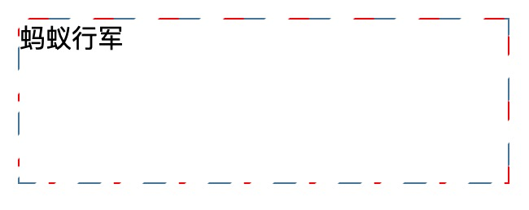


