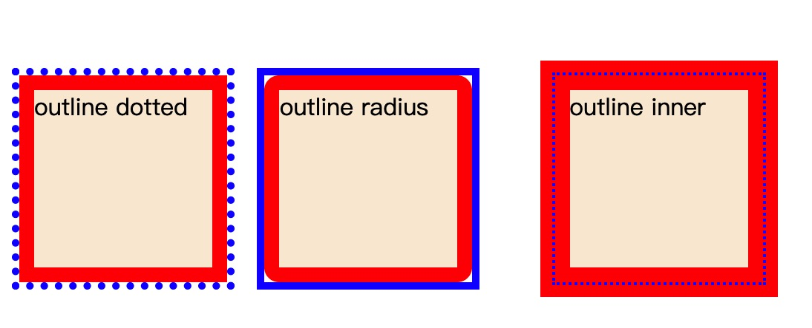

## 边框与背景

### 1.多重边框
#### box-shadow方案
理论上可以实现无限多层边框
```js
// html
<div class="box">box-shadow unset</div>
<div class="box1">box-shadow inset</div>

// css
.box{
  width: 120px;
  height: 120px;
  background-color: antiquewhite;
  box-shadow: 0 0 0 10px red,
              0 0 0 15px blue;
  margin: 15px;
  display: inline-block;
}
.box1{
  width: 120px;
  height: 120px;
  background-color: antiquewhite;
  box-shadow: 0 0 0 5px blue inset,
              0 0 0 15px red inset;
  padding: 15px;
  display: inline-block;
}
```


缺点：
1. box-shadow**本身不占位置**，需要通过设置内边距或者外边距来模拟它的”占位“.
2. unset的投影在元素的外圈，并**不是元素的可点击范围**，无法触发点击事件。可以使用inset的形式来绕过这一个问题。
3. 边框的样式只能是**实线**的。

#### outline方案
可以实现两层边框，而且边框样式可以多样。
```js
// html
<div class="box2">outline dotted</div>
<div class="box3">outline radius</div>
<div class="box4">outline inner</div>

// css
.box2{
  width: 120px;
  height: 120px;
  background-color: antiquewhite;
  border: 10px solid red;
  outline: 5px dotted blue;
  display: inline-block;
}
.box3{
  width: 120px;
  height: 120px;
  background-color: antiquewhite;
  border-radius: 10px;
  border: 10px solid red;
  outline: 5px solid blue;
  display: inline-block;
  margin: 0 20px;
}
.box4{
  width: 120px;
  height: 120px;
  background-color: antiquewhite;
  border: 20px solid red;
  outline: 2px dotted blue;
  outline-offset: -10px;
  display: inline-block;
  margin: 0 20px;
}
```  


缺点：
1. 只能模拟两层边框的场景。
2. 边框外边的outline也是不占位置的，有被覆盖的风险。
3. 圆角的outline不贴合，outline仍然是矩形的。


