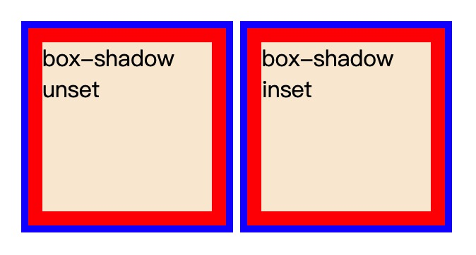

## 边框与背景

### 1.多重边框
#### box-shadow方案
理论上可以实现无限多层边框
```js
// html
<div class="box">box-shadow unset</div>
<div class="box1">box-shadow inset</div>

// css
.box{
  width: 120px;
  height: 120px;
  background-color: antiquewhite;
  box-shadow: 0 0 0 10px red,
              0 0 0 15px blue;
  margin: 15px;
  display: inline-block;
}
.box1{
  width: 120px;
  height: 120px;
  background-color: antiquewhite;
  box-shadow: 0 0 0 5px blue inset,
              0 0 0 15px red inset;
  padding: 15px;
  display: inline-block;
}
```

缺点：
1. box-shadow**本身不占位置**，需要通过设置内边距或者外边距来模拟它的”占位“.
2. unset的投影在元素的外圈，并**不是元素的可点击范围**，无法触发点击事件。可以使用inset的形式来绕过这一个问题。

#### outline方案