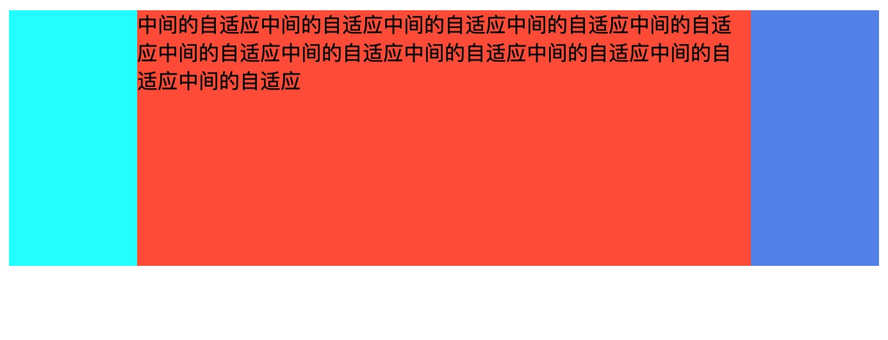

## 圣杯布局
### 圣杯布局的特点
1. 三栏布局，左右两边固定，中间自适应
2. 中间区域先加载(体验上考虑？)

### 实现方式
#### 1.float + 负margin —— 最传统的实现方式


```js
// html
<div class="container">
  <div class="center">
    中间的自适应中间的自适应中间的自适应中间的自适应中间的自适应中间的自适应中间的自适应中间的自适应中间的自适应中间的自适应中间的自适应
  </div>
  <div class="left"></div>
  <div class="right"></div>
</div>

// css
.container {
  width: 100%;
  padding: 0 100px;
  overflow: hidden;
  box-sizing: border-box;
}
.center {
  height: 200px;
  width: 100%;
  background-color: tomato;
  float: left;
}
.left {
  width: 100px;
  height: 200px;
  background-color: aqua;
  float: left;
  margin-left: -100%;  //百分比是相对于外部容器width，而不是自身
  position: relative;
  left: -100px;
}
.right {
  width: 100px;
  height: 200px;
  background-color: cornflowerblue;
  float: right;
  margin-right: -100px;
}
```  
##### margin负值的规则
1. 盒子最后的显示大小等于盒子的border+padding+正margin，而负margin不会影响其大小
2. 当负的偏移值大于盒子的尺寸时，这个盒子将不占空间，后续的元素会无视它，占据它原本的位置。在float元素中，可能会导致父元素高度塌陷。上面的例子就是利用了这一点。
3. margin的百分比取值，**取的是父元素宽度的百分比**，而不是自身。

##### **圣杯布局的问题**
传统的圣杯布局难点在于需要**将中间部分的内容先渲染**，所以必须将中间元素放在前面，然后采用float和margin:-100%的方式将左边的元素浮过去。这样虽然可以解决问题，但是也会有其他问题，就是当容器宽度小于left盒子的宽度时，-100%的值小于left盒子自身，就会出现left盒子无法浮上去，从而布局错乱。


#### 2.BFC+float
这种方式需要把center放在最后面,这是由于float不完全脱离文档流的原因

```js
// html
<div class="container">
  <div class="left"></div>
  <div class="right"></div>
  <div class="center">
    中间的自适应中间的自适应中间的自适应中间的自适应中间的自适应中间的自适应中间的自适应中间的自适应中间的自适应中间的自适应中间的自适应
  </div>
</div>

// CSS
.container {
  width: 100%;
  padding: 0 100px;
  overflow: hidden;
  box-sizing: border-box;
}
.center {
  background-color: tomato;
  height: 200px;
  overflow: hidden; //形成一个BFC
}
.left {
  width: 100px;
  height: 200px;
  background-color: aqua;
  float: left;
}
.right {
  width: 100px;
  height: 200px;
  background-color: blueviolet;
  float: right;
}

```  

#### 3.absolute
```js
// html
<div class="container">
  <div class="center">
    中间的自适应中间的自适应中间的自适应中间的自适应中间的自适应中间的自适应中间的自适应中间的自适应中间的自适应中间的自适应中间的自适应
  </div>
  <div class="left"></div>
  <div class="right"></div>
</div>

// css
.container {
  width: 100%;
  overflow: hidden;
  box-sizing: border-box;
  min-height: 200px;
  position: relative;
}
.container div {
  position: absolute;
}
.center {
  background-color: tomato;
  height: 200px;
  left: 100px;
  right: 100px;
}
.left {
  width: 100px;
  height: 200px;
  background-color: aqua;
  left: 0;
}
.right {
  width: 100px;
  height: 200px;
  background-color: blueviolet;
  right: 0;
}

```  
### 其他方式
flex grid都是可以实现的。

### 总结
这里主要是为了了解什么是圣杯布局，以及在没有flex和grid布局方式之前是如何去实现这种布局的。还有就是要**学习float和负margin这种用法，了解负margin的表现形式**。


